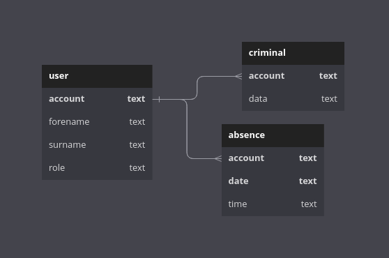

# Schillernova's Database Managment or for short SNDM

A repo with the Server-side Backend for the SNDI (Schillernova's Database Interface).

### Download

The latest builds can be downloaded from the [releases page](https://github.com/nwrenger/sndm/releases).

## Architecture - Including SNDI

This application follows the 3-tier principle.
* **UI Layer:** Developed by my friend. Getting the Data from Server Calls. It's named SNDI.
* **Application/Server Layer:** This is implemented using Rust and Rocket. Including a Swagger UI integration.
* **Database Layer:** The SQLite database that stores the persistent data specific to a project.

### UI Layer

Developed by [BoettcherDasOriginal](https://github.com/BoettcherDasOriginal). Look out there for further explainations.

### Application Layer

This layer is implemented in Rust ([src](src)) and Rocket(0.5 rc 3).

It is responsible for the consistency checks and business logic.
This layer also manages the database connection to store and fetch the project data.

Besides that, it also consists the managment and logic for a server using [Rocket](https://rocket.rs), including Swagger UI (using Utoipa).

### Database Layer

The [SQLite](https://sqlite.org/index.html) database has the following schema:

(The bold printed texts are the primary keys!)

## Usage

Just run the binary/exceutable file provided in the release. Make sure it's in the same Diractory as the dummy data file(benutzer.txt), otherwise it won't start. Run it with sudo/admin permission(because of server port being http://0.0.0.0:80).

## Current Todos

- [x] DB Managment
- [x] Making a real/openable DB File
- [x] Fetching User Data from IServ
- [x] Server Integration
- [x] Swagger UI Integration
- [x] Testing, Fixing, etc.
- [x] Logging? Why not!
- [ ] Network test (After [BoettcherDasOriginal](https://github.com/BoettcherDasOriginal) is finished with the UI)
