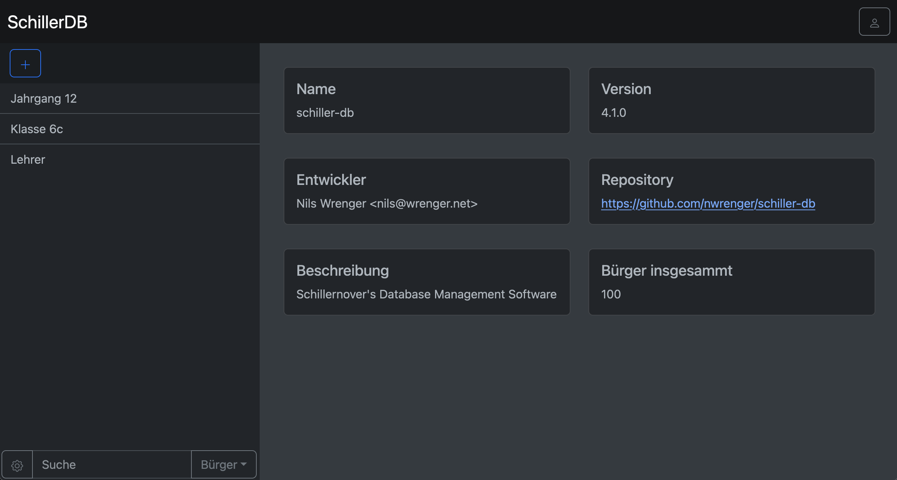
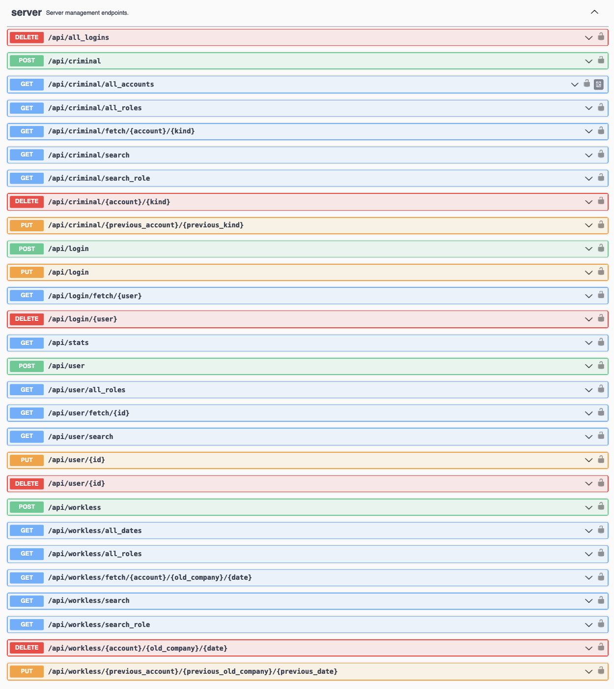
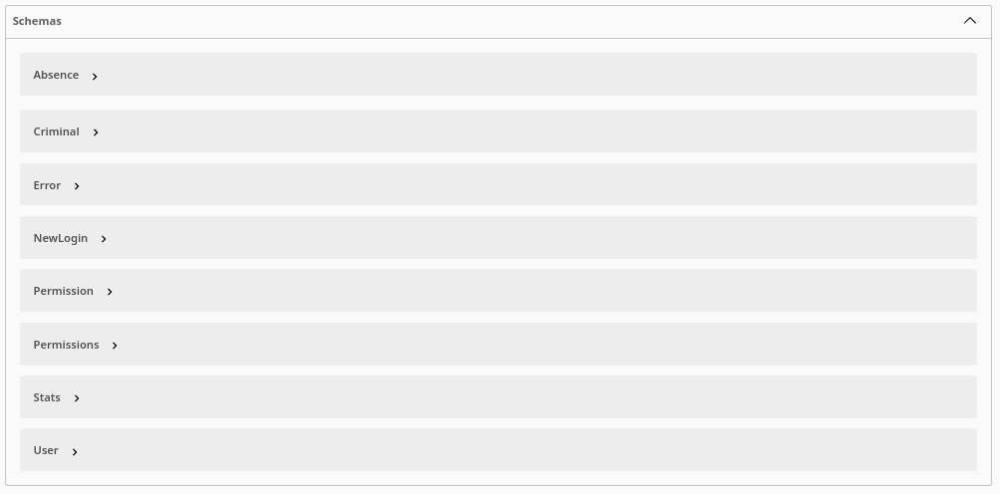

# Schillernover's Database Management or for short SchillerDB / schiller-db

A repo with the server-side backend and the frontend of the Database Application of the Schillerschool for the upcoming project week.

### Test Website

A Test Website can be found under [nils.wrenger.net](http://nils.wrenger.net). A test Login with no changing Permissions is User: alisa.timms with Password: 1. Have fun with testing. Report Bugs using the Issues on this Github repo. Note that version 4.0.0 is currently not deployed there.

### Download

The latest builds can be downloaded from the [releases page](https://github.com/nwrenger/schiller-db/releases). Note that version 4.0.0 has currently no build, I am working on that.

### Usage

Just run the binary/executable file provided in the release. Make sure it's in the same Directory as the dummy data file (benutzer.txt) and admin.env file otherwise it won't start. Run it with sudo/admin permission (because of server port being http://0.0.0.0:80). The path for the Swagger-UI is http://0.0.0.0/swagger-ui/ / http://localhost/swagger-ui/. In addition, using the admin.env file you can define your admin, which can't be deleted. This admin can add other Users and their permissions. Without those permissions you are unauthorized and can't interact with the Server/Database.

## Architecture

This application follows the 3-tier principle.
* **UI Layer:** Getting the Data from Server Calls.
* **Application/Server Layer:** This is implemented using Rust and Rocket. Including a Swagger UI integration.
* **Database Layer:** The SQLite database that stores the persistent data specific to a project.

### UI Layer

Developed by me and a few others (look to contributions). You can see a current state of the development, by visiting a [Test Website](#test-website).

It's developed by using intern Server Calls, Svelte and Bootstrap (for the UI). I finally finished the refactoring of the old plain JS version to this new and improved Svelte version. It's now way better structured and easier to develop new stuff. And Svelte generally is a big upgrade compared to old plain JS, it's a really good WebDev Framework.

A Picture of the Main Page:

### Application/Server Layer

This layer is implemented in Rust ([src](src)) and [Rocket](https://rocket.rs) (0.5 rc-3).

It is responsible for the consistency checks and business logic.
This layer also manages the database connection to store and fetch the project data.

Besides that, it also consists the management and logic for a server using [Rocket](https://rocket.rs), including Swagger UI (using the Utoipa Crate).

#### Server

The Server calls are:

- 8 for data table criminal and workless
- 6 for data table user
- 5 for logins (create, fetch, edit, delete, delete_all)
- stats - getting general statistics/infos

Swagger UI integrated via Utoipa:

Schemas:

Security:

- User System, an Admin, defined thought the admin.env file
- Admin can add User with Permissions what they can do and cannot do like: Reading/Writing for each Data Type (User, Workless, Criminal)
- each user can change their passwords
- the passwords are internally hashed and cannot be directly red out of the database
- logging every Server call (excluding Swagger UI - general GET requests) to separate file called 'log.txt' with Information who did what

### Database Layer

The [SQLite](https://sqlite.org/index.html) database has the following schema:

(The bold printed texts are the primary keys!)

## Current Todo's

- [x] DB Management
- [x] Making a real/openable DB File
- [x] Fetching User Data from IServ
- [x] Server Integration
- [x] Swagger UI Integration
- [x] Testing, Fixing, etc.
- [x] Logging? Why not!
- [x] SideBar -> User
- [x] Searching (including workless, criminal, user)
- [x] Main Input Container -> Stats when nothing and User when one is selected -> include changing and adding them
- [x] Login -> at the current Logout Button make a profile menu
- [x] In profile menu: Logins Creator with permission selection (makes our job a lot easier)
- [x] Workless Management
- [x] Criminal Management
- [x] fix Add Button (currently a little bit buggy)
- [x] Better Criminal/Workless adding process
- [x] Integration for Mobile
- [x] Finished Criminals Extended Data Fields
- [x] More specific search
- [x] Network test (after we are finished with the UI)
- [x] Using it in the project week -> worked really well
- [x] Changes due to customer feedback -> absence into workless
- [x] Moving Frontend to Svelte